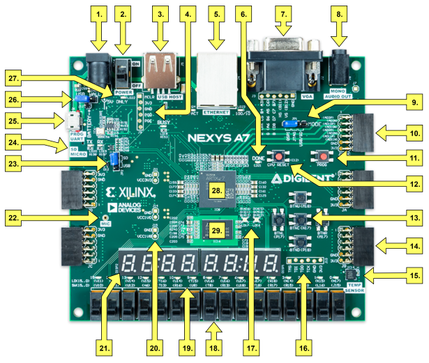
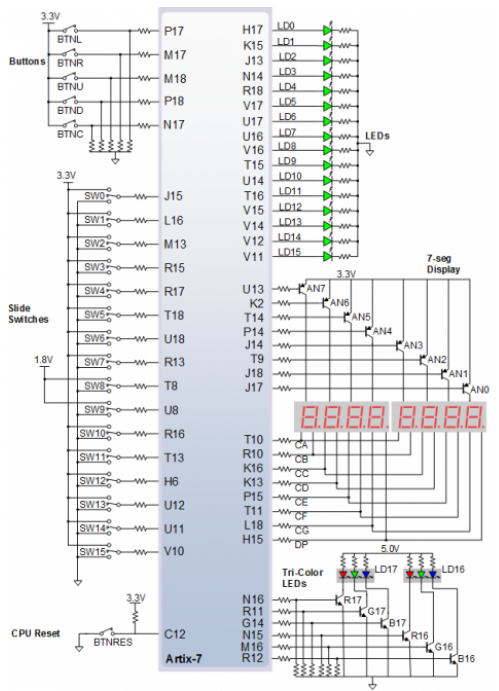
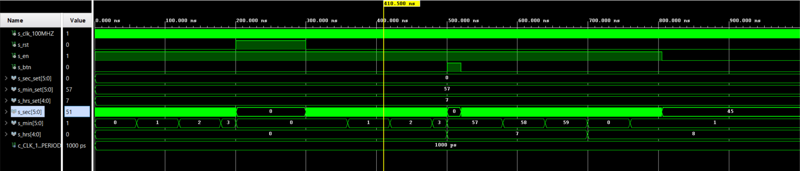
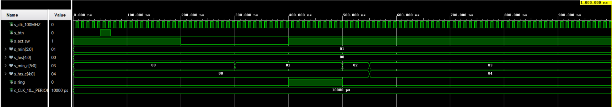
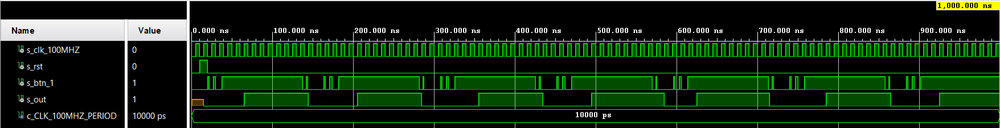
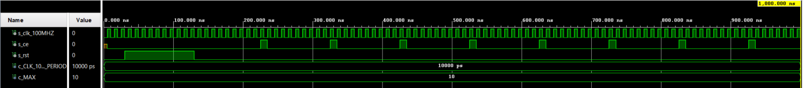

# Digital clock, with Time and Alarm (hh/mm/ss)

### Team members

* Lukáš Vizina
* Samuel Sedmák
* Erik Maděránek

### Table of contents

* [Project objectives](#objectives)
* [Hardware description](#hardware)
* [VHDL modules description and simulations](#modules)
* [TOP module description](#top)
* [Video](#video)
* [References](#references)

## Project objectives

Project goal is to implement digital clock on Nexys A7-50T board, including time setting and alarm function all in hh:mm:ss format.

The clock is controlled by 5 buttons and 2 switches. The output peripherals are an integrated eight digit 7-segment display (only 6 digits are used in this project) and an RGB LED implementing the alarm function.

## Hardware description

   #### Nexys A7-50T
   

| **Callout** | **Component Description** | **Callout** | **Component Description** |
   | :-: | :-: | :-: | :-: |
   | 1 | 	Power jack | 16 | JTAG port for (optional) external cable |
   | 2 | 	Power switch | 17 | Tri-color (RGB) LEDs |
   | 3 | USB host connector | 18 | Slide switches (16) |
   | 4 | PIC24 programming port (factory use) | 19 | LEDs (16) |
   | 5 | Ethernet connector | 20 | Power supply test point(s) |
   | 6 | FPGA programming done LED | 21 | Eight digit 7-seg display |
   | 7 | VGA connector | 22 | Microphone |
   | 8 | Audio connector | 23 | External configuration jumper (SD / USB) |
   | 9 | Programming mode jumper | 24 | MicroSD card slot |
   | 10 | Analog signal Pmod port (XADC) | 25 | Shared UART/ JTAG USB port |
   | 11 | FPGA configuration reset button | 26 | Power select jumper and battery header |
   | 12 | CPU reset button (for soft cores) | 27 | Power-good LED |
   | 13 | Five pushbuttons | 28 | Xilinx Artix-7 FPGA |
   | 14 | Pmod port(s) | 29 | DDR2 memory |
   | 15 | Temperature sensor |  |  |
   
   #### BASIC I/O schematic
   
   
.

## VHDL modules description

### `Timer.vhd`
This module is responsible for the core operation of the digital clock. It receives a clock signal that is slowed down to a one-second interval using the clock_enable.vhd module, where the parameter N_PERIODS is set to 10,000,000 (100MHz). The seconds count increments every second, looping from 0 to 59 and then restarting at 0. Similarly, the minutes count increases by one when the seconds reach 59, also cycling up to 59. The hours count advances when the minutes reach 59, counting up to 23 before resetting back to 0.

Initially, the clock starts at 00:00:00

[dig_clock testbench](Digital_Clock_Final/Digital_Clock_Final.srcs/sim_1/new/tb_digital_clock.vhd)

### `Alarm.vhd`
This module works both to remember the set alarm time and to trigger the alarm at the correct time. By pressing buttons RIGHT and LEFT we switch between hh/mm/ss and by pressing buttons DOWN and UP. The alarm function is active only when `alarm_active` is in the 1 position. If the values of the set alarm time and the current time are equal, the alarm is triggered.

[time_comp_alarm testbench](Digital_Clock_Final/Digital_Clock_Final.srcs/sim_1/new/tb_alarm.vhd)

### `button_debouncer.vhd`
Mechanical buttons often generate fake transitions when pressed due to its mechanical nature. If we want to set the time using pushbuttons, fake transitions would be problematic and create imprecisions, so it is necessary to get rid of them. Module called `debounce` is used to do the job. It consists of three D-latches connected in series. The first one takes the push button signal as its input. When the enable signal is on high level, the input gest shifted to the next latch. The outputs of all three latches are connected to an AND gate which output is output of the whole debouncer. `clock_enable.vhd` module is used as synchronous signal generator where its `N_PERIODS` value is set to 1 000 000 for 100 ms debounce delay.

[button_debouncer testbench](Digital_Clock_Final/Digital_Clock_Final.srcs/sim_1/new/tb_button_debouncer.vhd)

### `cnt_up_down.vhd`

### `hex_7seg.vhd`

### `driver_7seg_6digits.vhd`
Predesigned display driver from lab exercises modified to control 6 digits (hh:mm:ss).

[driver_7seg_6digits testbench](Digital_Clock_Final/Digital_Clock_Final.srcs/sim_1/new/tb_driver_7seg_4digits.vhd)

### `to_bcd_conv.vhd`
The outputs of the `dig_clock.vhd` module are 6-bit vectors in case of minutes and seconds and a 5-bit vector in case of hours. This block is used to convert these vectors into two 4-bit BCD values, each representing one decimal digit, which then can be feed into the 7-segment driver.

[to_bcd_conv testbench](Digital_Clock_Final/Digital_Clock_Final.srcs/sim_1/new/tb_to_bcd_conv.vhd)

### `clock_enable.vhd`
Predesigned clock enable signal generator from lab exercises used without any changes.

[clock_enable testbench](Digital_Clock_Final/Digital_Clock_Final.srcs/sim_1/new/tb_clock_enable.vhd)

### `driver_dig_clock.vhd`
This block is used to encapsulate the `dig_clock.vhd`, `clock_setter.vhd` and `time_comp_alarm.vhd` modules. In addition, it contains a multiplexer, which switches between the current time display and the time setting, depending on the selected mode.

[driver_dig_clock testbench](Digital_Clock_Final/Digital_Clock_Final.srcs/sim_1/new/tb_driver_dig_clock.vhd)

## TOP module description

All the main blocks are interconnected in the `top.vhd` module and connected to hardware components.

## References

